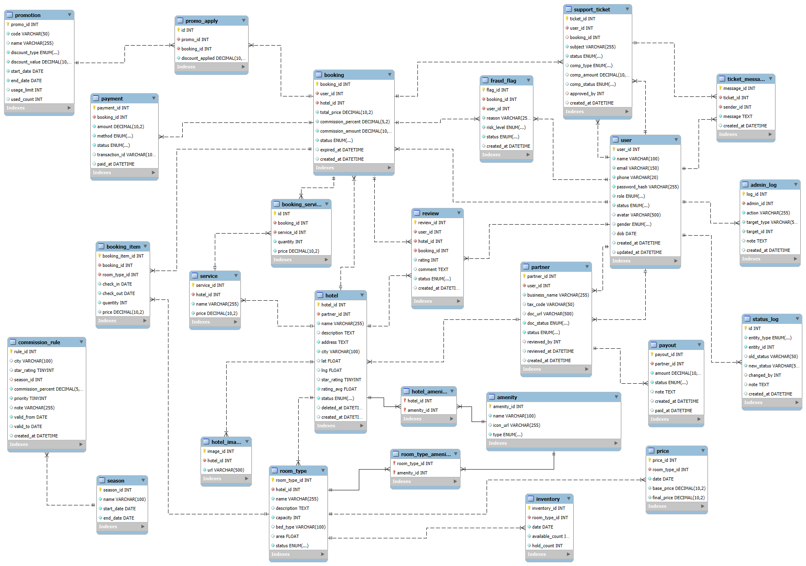

# 🏨 HỆ THỐNG ĐẶT PHÒNG TRỰC TUYẾN NOWAYHOME

**Tổ chức:** NoWayHomee
**Tài liệu:** Thiết kế Kiến trúc, Logic xử lý và Cơ sở dữ liệu

Tài liệu này cung cấp cái nhìn tổng thể về thiết kế của hệ thống NoWayHome, bao gồm mô hình dữ liệu, phân rã chức năng và luồng xử lý nghiệp vụ cho ba phân hệ chính: **Khách hàng**, **Đối tác** và **Quản trị viên (Admin)**.

---

## 📊 1. Thiết Kế Cơ Sở Dữ Liệu (Database Design)

Mô hình thực thể kết nối (ERD) thể hiện cấu trúc lưu trữ, các bảng dữ liệu (MySQL) và mối quan hệ giữa các thực thể cốt lõi trong hệ thống.

> 🔗 [Mở ERD draw.io](https://viewer.diagrams.net/?tags=%7B%7D&lightbox=1&highlight=0000ff&edit=_blank&layers=1&nav=0&page=10&title=NoWayHome.drawio&dark=auto#Uhttps%3A%2F%2Fdrive.google.com%2Fuc%3Fid%3D1E2XdDDvcfCm3aD3TmFTymMHeSQF2c1DT%26export%3Ddownload)

---

## 🌐 2. Sơ Đồ Tổng Quan Hệ Thống (System Overview)

Sơ đồ Use Case tổng quan thể hiện các tác nhân (Actors) và những chức năng mức cao nhất mà hệ thống cung cấp.

> 🔗 [Mở UC Tổng quan trên draw.io](https://viewer.diagrams.net/?tags=%7B%7D&lightbox=1&highlight=0000ff&edit=_blank&layers=1&nav=0&page=6&title=NoWayHome.drawio&dark=auto#Uhttps%3A%2F%2Fdrive.google.com%2Fuc%3Fid%3D1E2XdDDvcfCm3aD3TmFTymMHeSQF2c1DT%26export%3Ddownload)

---

## 👤 3. Phân Hệ Khách Hàng (Customer Module)

Phân hệ dành cho người dùng cuối (End-user) thực hiện các thao tác tìm kiếm, đặt phòng và quản lý tài khoản.

### 3.1. Use Case Tổng Quan Khách Hàng

> 🔗 [Mở UC Khách hàng trên draw.io](https://viewer.diagrams.net/?tags=%7B%7D&lightbox=1&highlight=0000ff&edit=_blank&layers=1&nav=0&page=7&title=NoWayHome.drawio&dark=auto#Uhttps%3A%2F%2Fdrive.google.com%2Fuc%3Fid%3D1E2XdDDvcfCm3aD3TmFTymMHeSQF2c1DT%26export%3Ddownload)

### 3.2. Phân Rã Chức Năng (WBS) Khách Hàng

> 🔗 [Mở PRCN Khách hàng trên draw.io](https://viewer.diagrams.net/?tags=%7B%7D&lightbox=1&highlight=0000ff&edit=_blank&layers=1&nav=0&page=0&title=NoWayHome.drawio&dark=auto#Uhttps%3A%2F%2Fdrive.google.com%2Fuc%3Fid%3D1E2XdDDvcfCm3aD3TmFTymMHeSQF2c1DT%26export%3Ddownload)

### 3.3. Luồng Xử Lý Tuần Tự (Sequence Diagram) Khách Hàng

> 🔗 [Mở Luồng Khách Hàng trên draw.io](https://viewer.diagrams.net/?tags=%7B%7D&lightbox=1&highlight=0000ff&edit=_blank&layers=1&nav=0&page=3&title=NoWayHome.drawio&dark=auto#Uhttps%3A%2F%2Fdrive.google.com%2Fuc%3Fid%3D1E2XdDDvcfCm3aD3TmFTymMHeSQF2c1DT%26export%3Ddownload)

---

## 🏢 4. Phân Hệ Đối Tác (Partner/Host Module)

Phân hệ dành cho chủ khách sạn/chỗ nghỉ (Host) để quản lý phòng, giá cả và theo dõi đơn đặt phòng.

### 4.1. Use Case Tổng Quan Đối Tác

> 🔗 [Mở UC Đối tác trên draw.io](https://viewer.diagrams.net/?tags=%7B%7D&lightbox=1&highlight=0000ff&edit=_blank&layers=1&nav=0&page=4&title=NoWayHome.drawio&dark=auto#Uhttps%3A%2F%2Fdrive.google.com%2Fuc%3Fid%3D1E2XdDDvcfCm3aD3TmFTymMHeSQF2c1DT%26export%3Ddownload)

### 4.2. Phân Rã Chức Năng (WBS) Đối Tác

> 🔗 [Mở PRCN Đối tác trên draw.io](https://viewer.diagrams.net/?tags=%7B%7D&lightbox=1&highlight=0000ff&edit=_blank&layers=1&nav=0&page=1&title=NoWayHome.drawio&dark=auto#Uhttps%3A%2F%2Fdrive.google.com%2Fuc%3Fid%3D1E2XdDDvcfCm3aD3TmFTymMHeSQF2c1DT%26export%3Ddownload)

### 4.3. Luồng Xử Lý Tuần Tự (Sequence Diagram) Đối Tác

> 🔗 [Mở Luồng Đối tác trên draw.io](https://viewer.diagrams.net/?tags=%7B%7D&lightbox=1&highlight=0000ff&edit=_blank&layers=1&nav=0&page=4&title=NoWayHome.drawio&dark=auto#Uhttps%3A%2F%2Fdrive.google.com%2Fuc%3Fid%3D1E2XdDDvcfCm3aD3TmFTymMHeSQF2c1DT%26export%3Ddownload)

---

## 🛡️ 5. Phân Hệ Quản Trị Viên (Admin Module)

Phân hệ dành cho ban quản trị hệ thống NoWayHome để kiểm duyệt đối tác, quản lý người dùng và thống kê doanh thu.

### 5.1. Use Case Tổng Quan Admin

> 🔗 [Mở UC Admin trên draw.io](https://viewer.diagrams.net/?tags=%7B%7D&lightbox=1&highlight=0000ff&edit=_blank&layers=1&nav=0&page=9&title=NoWayHome.drawio&dark=auto#Uhttps%3A%2F%2Fdrive.google.com%2Fuc%3Fid%3D1E2XdDDvcfCm3aD3TmFTymMHeSQF2c1DT%26export%3Ddownload)

### 5.2. Phân Rã Chức Năng (WBS) Admin

> 🔗 [Mở PRCN Admin trên draw.io](https://viewer.diagrams.net/?tags=%7B%7D&lightbox=1&highlight=0000ff&edit=_blank&layers=1&nav=0&page=2&title=NoWayHome.drawio&dark=auto#Uhttps%3A%2F%2Fdrive.google.com%2Fuc%3Fid%3D1E2XdDDvcfCm3aD3TmFTymMHeSQF2c1DT%26export%3Ddownload)

### 5.3. Luồng Xử Lý Tuần Tự (Sequence Diagram) Admin

> 🔗 [Mở Luồng Admin trên draw.io](https://viewer.diagrams.net/?tags=%7B%7D&lightbox=1&highlight=0000ff&edit=_blank&layers=1&nav=0&page=5&title=NoWayHome.drawio&dark=auto#Uhttps%3A%2F%2Fdrive.google.com%2Fuc%3Fid%3D1E2XdDDvcfCm3aD3TmFTymMHeSQF2c1DT%26export%3Ddownload)
